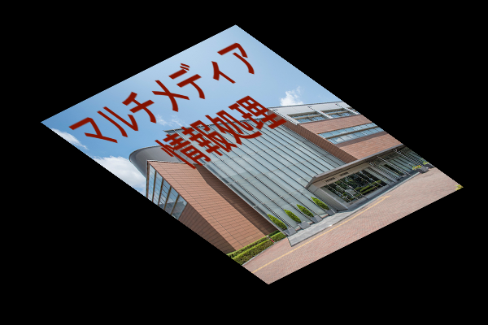
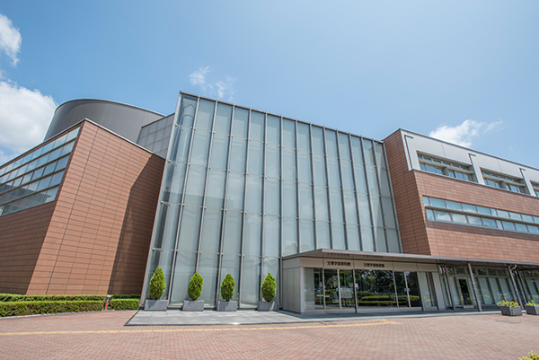

# ミニ課題１　６月１１日　梅谷担当１

- 締め切りは土曜日の夜までです(日曜日に採点したいので)
- 遅れても減点するだけなので，できるだけ提出してください．
- 技術的な問題で何かつまずいたら（環境構築ができないなど）Slackで教えて下さい
  

## 課題の提出方法

- gitを使ってローカル上にレポジトリを構築
  + 課題のレポジトリをダウンロード
```bash
git clone https://github.com/MediaProcessingClass/visproc_(ユーザ名)
```

- kadai1という名前のブランチを切る
```bash
cd visproc_(ユーザー名)
git branch -a
git checkout master
git branch kadai1
```

- アップロードする
```bash
cd ..
git add .
git commit -m "completed kadai1"
git push --set-upstream origin kadai1
```

- ブラウザでプルリクエストを作成


## 問題１（５点）

以下のファイン変換されて歪んだ画像を，新たに別のアフィン変換することによって元に戻すようなPythonのコードを書いて，結果の画像をこの文書```readme.md```に貼り付けて下さい．



- この歪んだ画像は```warped.png```という名前でこのフォルダにあります．
- このファイン変換された画像は以下のコードによって作成されました．以下のコードでどのようなアフィン行列が使われてるかを参考にしてください．

```python
import cv2
import numpy as np

if __name__ == "__main__":
	img = cv2.imread("input.jpg")
	img_size = (img.shape[1],img.shape[0])
	M = np.float32([[0.4,0.7,50],[-0.2,0.5,+150]])
	dst = cv2.warpAffine(img,M,img_size)
	cv2.imwrite("warped.png",dst)
```

- ポイント１：アフィン行列の逆行列はアフィン行列です．
- ポイント２：逆行列はnumpyの，numpy.linalg.invという関数を使って簡単に計算できます．

---

- このフォルダにある``invaffine.py``という名前の名前のファイルを変更してコードを書いて下さい．
- 以下に結果の画像を貼り付けて下さい．Markdonw形式の文章の書き方は参考文献を参考にしてください


## 問題２（５点）

以下の２つの画像をクロマキー合成して，スーツの女性がキャンパスにいるような画像を作成するPythonコードを書いて下さい．




- ポイント１：OpenCVでは画像はRGBの順ではなく，BGRの順で格納されたNumpyの行列を扱います．
- ポイント２：OpenCVでは画像のピクセルの配列が，行列だと考えたようにインデックスをつけます．画像の横幅がNピクセル，高さがMピクセルの場合，画像の左上のピクセルのインデックスが（０，０），右下のピクセルのインデックスが（M,N）となります．
- ポイント３：OpenCVでimshowを使って画像を表示させるときは，ピクセルのチャネルあたりに１バイトのデータを持つようなNumpy配列を用意します．画像を加工するときには，ピクセルあたりに１バイトのデータはオーバーフローしたりして不便なので，浮動小数点のNumpyにすることが多いです．Numpy配列の型変換はnumpy.astype()関数を使います．
- ポイント４：このグリーンバックの色はだいたい（青１６０，緑８０，赤０）です．

---

- プログラムの名前は```chromakey.py```という名前で途中まで書いたものがあるのでそこから更新してく下さい．出力結果の画像は```synth.png```という名前にしてこのフォルダに置いて下さい．
- 合成結果をMarkdownを使って以下に貼って下さい．Markdonw形式の文章の書き方は参考文献を参考にしてください


## 参考になるWebサイトなど

OpenCV
- [OpenCVのドキュメント: 画像の帰化変換](http://labs.eecs.tottori-u.ac.jp/sd/Member/oyamada/OpenCV/html/py_tutorials/py_imgproc/py_geometric_transformations/py_geometric_transformations.html)
- [Python, OpenCVで幾何変換（アフィン変換・射影変換など）](https://note.nkmk.me/python-opencv-warp-affine-perspective/)
- [完全に理解するアフィン変換](https://qiita.com/koshian2/items/c133e2e10c261b8646bf)

Numpy
- [numpyの使い方](https://qiita.com/jyori112/items/a15658d1dd17c421e1e2)
- [Numpyの使い方一覧](https://qiita.com/mochidan/items/50a18a663aa97f62c83c)

Markdown

- [Markdownチートシート](https://qiita.com/Qiita/items/c686397e4a0f4f11683d)
- [Qiita Markdown書き方まとめ](https://qiita.com/shizuma/items/8616bbe3ebe8ab0b6ca1)
- [Markdown記法サンプル集](https://qiita.com/tbpgr/items/989c6badefff69377da7)


画像の出典：

- グリーンバックの女性　https://www.pakutaso.com/20161005297post-9335.html
- 日本大学・文理キャンパス https://www.chs.nihon-u.ac.jp/community/

