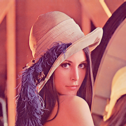
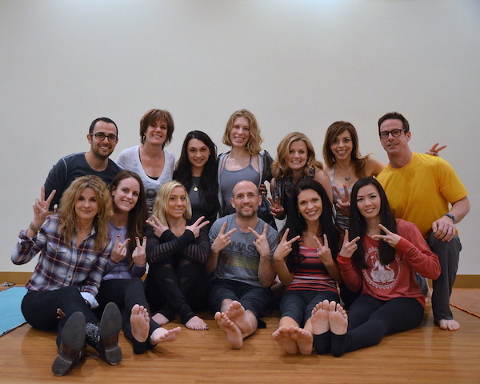

# ミニ課題１　６月１８日　梅谷担当２


授業スライド：https://www.dropbox.com/s/lop88f1vv5bqbn2/lec08_pythonimage2.pdf?dl=0


- 締め切りは土曜日の夜までです(日曜日に採点したいので)
- 遅れても減点するだけなので，できるだけ提出してください．
- 技術的な問題で何かつまずいたら（環境構築ができないなど）Slackで教えて下さい


## 課題の提出方法

- ローカル・レポジトリに移動
  - ローカル・レポジトリが無い場合は[課題１の解説書](../kadai1/readme.md)を参考にしてクローンする

```bash
cd visproc_(ユーザ名)　# レポジトリのトップに移動
```

- kadai2という名前のブランチを*masterから派生して*作る→課題を開始する
```bash
git checkout master   # マスターブランチに移動
git pull              # リモートのmasterブランチをローカルに反映（コンフリクトがあればそれを解決）
git branch -a         # masterブランチにいることを確認
git branch kadai2     # masterブランチから派生したkadai2というブランチを作成
git checkout kadai2   # kadai2ブランチに移動
git branch -a         # kadai2ブランチにいることを確認
```

- 課題の内容をこなした後にアップロードする
```bash
cd visproc_(ユーザ名)   # レポジトリのトップに移動
git branch -a   # 現在kadai2というブランチにいることを再確認
git add .       # 変更されたファイルをステージする
git status      # ステージされたファイルを確認する
git commit -m "completed kadai2"         # 変更をコミットする．コメントはなんでもよい
git push --set-upstream origin kadai2    # リモートレポジトリのkadai2というブランチにプッシュする
```

- ブラウザでプルリクエストを作成　→　６月１２日の授業スライドを参考にして下さい
  
  - プルリクエストは教員が確認してから閉じるので，*勝手に閉じないで*ください．
  
  - プルリクエストは１つの課題あたりに１つ開いて下さい（複数開かない）
  
    

***


## 問題１（５点）平均フィルタの繰り返し

以下の画像に３ｘ３の平均フィルタを適応して滑らかにする処理を繰り返し適応して下さい



-   ↓↓↓↓以下に元の画像，と５回，１０回，５０回フィルタを適応した３つの画像を貼り付けて下さい
  - それぞれ```filtered_5.png```，```filtered_10.png```，```filtered_50.png```という名前にして下さい．

- ポイント：```filter.py```というプログラムに途中まで書いてあります．参考にして下さい．

  - ```python3 filter.py```というコマンドで実行

- ポイント：フィルタによって輝度の平均値が変わらないようにフィルタの係数を調整して下さい．

  


## 問題２（５点）

以下の画像からOpenCVの顔検出の機能を使って，顔を検出．顔を囲む円形領域を残して，単色に塗りつぶされたような画像を作る．




↓↓↓以下に画像を貼り付けて下さい


- ポイント：このフォルダにある```face.py```というプログラムに途中まで書いてあります．

  - ```python3 face.py```というコマンドで実行
  - マスクを作る部分まで書いてあるのでkadai1よりも簡単か？

- ポイント：結果は```detect.png```という名前の画像にして下さい

  


---


## 参考になるWebサイトなど

OpenCV
- [Python, OpenCVで顔検出と瞳検出（顔認識、瞳認識）](https://note.nkmk.me/python-opencv-face-detection-haar-cascade/)

- [Python, OpenCVで図形描画（線、長方形、円、矢印、文字など）](https://note.nkmk.me/python-opencv-draw-function/)
- [Python, OpenCV, NumPyで画像のアルファブレンドとマスク処理](https://note.nkmk.me/python-opencv-numpy-alpha-blend-mask/)

Markdown

- [Markdownチートシート](https://qiita.com/Qiita/items/c686397e4a0f4f11683d)


画像の出典：

- lena: https://en.wikipedia.org/wiki/Lenna
- 集合写真： https://www.flickr.com/photos/sonicfitness/11497126906/in/photostream/

