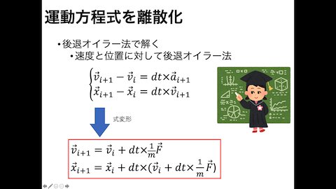
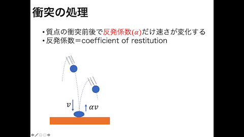

# ミニ課題4　7月2日　第１０回目（梅谷担当）


授業スライド：
- 締め切りは土曜日の夜までです(日曜日に採点したいので)
- 遅れても少し減点するだけなので，できるだけ提出してください．
- 技術的な問題で何かつまずいたら（環境構築ができないなど）Slackで教えて下さい


## 課題の提出方法

- ローカル・レポジトリに移動
  - ローカル・レポジトリが無い場合は[課題１の解説書](../kadai1/readme.md)を参考にしてクローンする

```bash
cd visproc_(ユーザ名)　# レポジトリのトップに移動
```

- kadai4という名前のブランチを*masterから派生して*作る→課題を開始する
```bash
git checkout master   # マスターブランチに移動
git pull              # リモートのmasterブランチをローカルに反映（コンフリクトがあればそれを解決）
git branch -a         # masterブランチにいることを確認
git branch kadai4     # masterブランチから派生したkadai3というブランチを作成
git checkout kadai4   # kadai4ブランチに移動
git branch -a         # kadai4ブランチにいることを確認
```

- 課題の内容をこなした後にアップロードする
```bash
cd visproc_(ユーザ名)   # レポジトリのトップに移動
git branch -a   # 現在kadai3というブランチにいることを再確認→いなければkadai4をチェックアウト
git add .       # 変更されたファイルをステージする
git status      # ステージされたファイルを確認する
git commit -m "completed kadai4"         # 変更をコミットする．コメントはなんでもよい
git push --set-upstream origin kadai4    # リモートレポジトリのkadai4というブランチにプッシュする
```

- ブラウザでプルリクエストを作成　→　６月１２日の授業スライドを参考にして下さい
  
  - プルリクエストは教員が確認してから閉じるので，*勝手に閉じないで*ください．
  
  - プルリクエストは１つの課題あたりに１つ開いて下さい（複数開かない）
  
    

***


## 課題の準備

もしも，```PyOpenGL```，```glfw```，```numpy```がインストールされていない場合，以下のコマンドでそれぞれインストールする．

```bash
pip3 install PyOpenGL
pip3 install glfw
pip3 install numpy
```


---


## 問題１プログラムの実行確認

質点のアニメーション表示するプログラム```points.py```を実行して，実行した様子をスクリーンショット画像を撮ってこのドキュメントに貼り付けて下さい．


↓↓↓スクリーンショット画像をここに貼り付ける


## 問題2 ：重力を加える

現在の```points.py```は重力の効果が入っておらず，無重力中で質点が移動するようなシミュレーションになっています．```points.py```に重力の項を加えて下さい．シミュレーションを流した様子のスクリーンショットをこのドキュメントに貼りつけて下さい．


↓↓↓スクリーンショット画像をここに貼り付ける


- ポイント１：重力の変数自体は```point.py```に定義されています．
- ポイント２：授業スライドの以下の部分が役に立つかもしれません




## 問題３：左右の壁と天井で反発させる

現在の```points.py```は床でしか反発しないようになっています．左右の壁と天井で反発させるように```point.py```のコードを書き換えて下さい．またシミュレーションを流した様子のスクリーンショットをこのドキュメントに貼り付けて下さい．


↓↓↓スクリーンショット画像をここに貼り付ける


- ポイント１：授業スライドの以下の部分が役に立つかもしれません．




---


## 参考になるWebサイトなど

OpenGL
- [Python + GLFW + OpenGL](https://qiita.com/Dhichisutto/items/76ec93c690caf20cedb9)
- [GLUTによる「手抜き」OpenGL入門](https://tokoik.github.io/opengl/libglut.html)
- [モデルビュー変換(OpenGL入門)](http://wisdom.sakura.ne.jp/system/opengl/gl11.html)
- [射影変換(OpenGL入門)](http://wisdom.sakura.ne.jp/system/opengl/gl12.html)
- [Python3で始めるOpenGL4](https://codelabo.com/posts/20200228175104)

- https://risalc.info/src/rodrigues-rotation.html)

Markdown

- [Markdownチートシート](https://qiita.com/Qiita/items/c686397e4a0f4f11683d)

  


